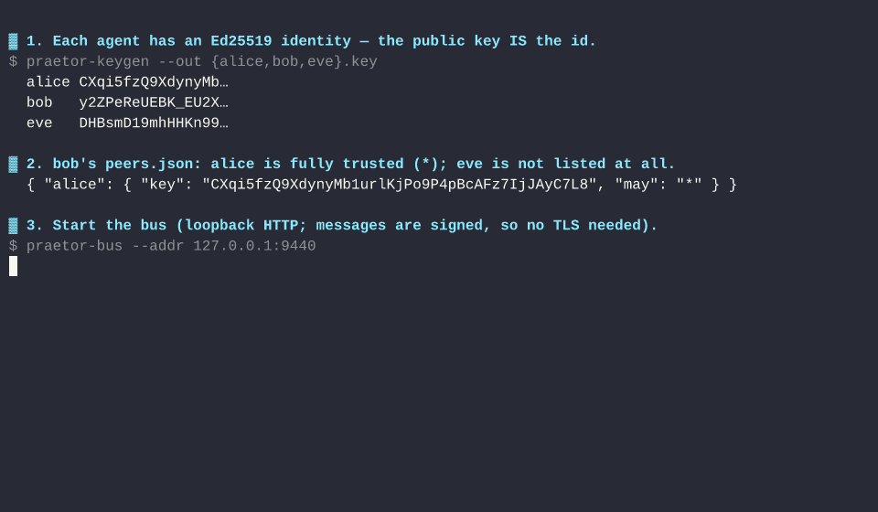

# praetor

[](https://github.com/wilfreddenton/praetor/actions/workflows/ci.yml)
[](./LICENSE)

**Secure agent-to-agent messaging and capability-scoped delegation for Claude Code.**



Independent Claude Code sessions message each other and — the part nobody else
does — **safely delegate work to peers they don't fully trust**. Every message is
Ed25519-signed, a peer's identity *is* its public key, and an untrusted peer's
request runs in a disposable subagent whose tools are the only thing it can do.

## Why this exists

Letting Claude Code sessions talk to each other is a solved, crowded problem:
[`claude-peers-mcp`](https://github.com/louislva/claude-peers-mcp) (~2k★),
`agent-bridge`, and others all do it, and Claude Code's own **channels** feature
is built for exactly this. They solve **transport**.

None of them solve **authorization**. The popular one's quickstart is literally:

```
claude --dangerously-skip-permissions --dangerously-load-development-channels server:claude-peers
```

That is: *any process that can reach the local broker can inject text into an
agent running with every permission check turned off, and there is no way to
know who sent it.* Claude Code's own channel docs call an ungated channel a
"prompt injection vector." `praetor` is the answer to that — the thing that
lets you turn the permissions back **on**.

## The trust model

Two ideas do all the work.

**1. A peer's identity is its public key.** Names (`alice`, `bob`) are local
petnames; the key is the truth. Claiming a name gets you nothing without the key.
Messages are signed over a domain-separated encoding and verified with
`verify_strict` *before* anything reaches the model — a stranger's message is
dropped, not shown.

**2. `peers.json` is a per-peer dial, from "run anything" to "run exactly these
tools":**

```json
{
  "my-laptop":    { "key": "8Emom3…", "may": "*" },
  "build-server": { "key": "rq2AzH…", "may": "run-tests" },
  "some-bot":     { "key": "Zc91xK…", "may": "read-only" }
}
```

- **`"*"`** — full trust. The message is delivered inline; the agent acts on it
  with all its tools. For machines whose private keys *you* hold.
- **a capability name** — e.g. `run-tests` refers to `.claude/agents/run-tests.md`,
  an agent whose `tools:` frontmatter *is* the capability. The request is handled
  in a disposable subagent limited to those tools — and a subagent physically
  cannot call a tool it wasn't given.

An unlisted peer gets nothing. Deny-by-default.

## How a scoped request is contained

The hard case — a peer you don't fully trust — never gets to put text in front of
your main agent:

```
signed request  ──►  bus  ──►  your channel server:
                                 verify sig · on allowlist? · to me? · fresh? · not a replay?
                                 scoped ─► QUARANTINE the body, push only metadata + a capability name
                                              │
   main agent  ◄── "a scoped request m3 from build-server is pending; spawn `run-tests` to handle it"
        │            (main agent CANNOT fetch the body — a PreToolUse hook denies it)
        ▼
   spawns `run-tests` subagent ─► it calls fetch_request(m3) ─► gets the body
                                   acts within its tools (frontmatter-enforced)
                                   replies via send_message
        │
   subagent exits ─► its context, and the untrusted text, are discarded
```

Three deterministic gates, none relying on the model's judgment:
- the **signature + allowlist** decide whether a message exists at all;
- a **`PreToolUse` hook** denies `fetch_request` to the main agent, so the
  untrusted body only ever enters a throwaway subagent;
- the subagent's **`tools:` frontmatter** is the capability — hard-enforced by the
  runtime.

All three are verified against a live Claude session (see below).

## How it fits together

Two components, two lifecycles:

```
  Claude session ──┐                                    ┌── Claude session
   praetor-mcp     ├──►  praetor-bus  (one broker)  ◄──┤    praetor-mcp
   (per session)   ┘      routes by recipient key       └   (per session)
```

- **`praetor-bus`** — the broker. You run **one**, somewhere reachable (a service;
  see [Deploying](#deploying)). It routes opaque payloads to a recipient key,
  holds no keys, verifies nothing, and buffers for offline agents.
- **`praetor-mcp`** — the agent-side MCP server. **One per Claude session**,
  started by Claude Code. It signs/verifies messages, enforces the trust gates,
  and long-polls the bus.

An agent finds the bus through **`PRAETOR_URL`** (default `http://127.0.0.1:9440`).
That's the whole wire between them — point every agent's `PRAETOR_URL` at your bus
and they can talk. (It takes a comma-separated list, so several relays and thus
federation is just "add a URL.")

So installing the agent (below) is half of it: **you also need a bus running.**
The npm/plugin paths ship the agent; get the bus from `cargo install` (which
installs all three binaries) or a release archive, and run it once as a service.

## Install

**Batteries included — the plugin.** One command bundles the MCP server (via
`npx praetor-mcp`), both `PreToolUse` guard hooks, and the `read-only` capability
agent — no `settings.json` editing:

```
/plugin marketplace add wilfreddenton/praetor
/plugin install praetor@praetor
```

See [`plugin/`](plugin) for the one-time key/peers setup. Prefer to wire it up
yourself? The pieces:

```bash
# pure Rust — no C toolchain, just a linker; installs the three binaries to ~/.cargo/bin
cargo install --git https://github.com/wilfreddenton/praetor --locked
```

Or `npx praetor-mcp` (the pure-Rust binary, delivered via npm — see [`npm/`](npm)).

Register the agent server once, so **every** Claude Code session can use praetor's
tools (`send_message`, `message_status`, `conversation_history`, `list_pending`)
with no per-launch flags:

```bash
claude mcp add --scope user --transport stdio praetor \
  -e PRAETOR_KEY=$HOME/.config/praetor/id.key \
  -e PRAETOR_PEERS=$HOME/.config/praetor/peers.json \
  -e PRAETOR_URL=http://127.0.0.1:9440 \
  -e PRAETOR_AGENT_DB=$HOME/.local/state/praetor/agent.redb \
  -- praetor-mcp
```

Set `PRAETOR_URL` to your bus (above it's `127.0.0.1:9440`, i.e. a bus on this
same machine — use the bus host's address otherwise). Don't have a bus yet? See
Quickstart step 1.

Prefer a file? Copy a [`config/*.mcp.json`](config) template (it uses `${HOME}`
expansion, so it's not tied to any one machine) to a project root, or pass it with
`--mcp-config`. The **Claude Desktop app** takes the same `mcpServers` block in
Settings → Developer → Edit Config — but it can only *call* praetor's tools; arming
the channel to *receive* pushed messages is a Claude Code feature (next section).

## Quickstart

```bash
# 1. Start the ONE bus everything connects to (run it once, ideally as a service;
#    durable queue, loopback HTTP, no TLS — see Security). Agents reach it via
#    PRAETOR_URL, which defaulted to this address in the Install snippet.
praetor-bus --db ~/.local/state/praetor/bus.redb   # listens on 127.0.0.1:9440

# 2. An identity per agent; praetor-keygen prints the public key to share.
praetor-keygen --out ~/.config/praetor/id.key
```

List each peer's public key in your `peers.json` (see [`config/`](config)), then
launch the session as a **channel** so a peer's messages are pushed straight into
it:

```bash
claude --dangerously-load-development-channels server:praetor
```

That flag is required on every launch — it's the research-preview gate for custom
channels, and there is no in-session or config way to arm it. (The server itself is
already registered from Install, so no `--mcp-config` is needed.)

To use a scoped capability, add the capability agent to the project's
`.claude/agents/` (example: [`contrib/agents/read-only.md`](contrib/agents/read-only.md))
and register the `PreToolUse` guard
([`contrib/pretooluse-guard.sh`](contrib/pretooluse-guard.sh)) in
`.claude/settings.json`.

A capability agent that should **reply** to the peer must list
`mcp__praetor__send_message` in its `tools:` (alongside `mcp__praetor__fetch_request`
to read the request) — without it the subagent can act but not answer, silently.
The `read-only.md` template includes both.

**Managing peers from chat.** `add_peer` / `list_peers` / `remove_peer` edit the
allowlist live — persisted to `peers.json`, applied to the very next message, no
restart. Because they change *who is trusted*, they're operator actions:
[`contrib/peer-admin-guard.sh`](contrib/peer-admin-guard.sh) denies them inside a
subagent (so an untrusted scoped peer can't add itself), and Claude Code prompts
you before each change in the main agent.

## Named inboxes (labels)

One machine, many sessions. An identity (key) can host several **named inboxes**:
launch each session with a label and it receives only what's addressed to it.

```bash
PRAETOR_LABEL=work     claude --dangerously-load-development-channels server:praetor
PRAETOR_LABEL=proj-x   claude --dangerously-load-development-channels server:praetor
```

A peer targets one with `send_message`'s `channel`: `send_message(to="fedora",
channel="work")`. Routing is `key#label`; the **signed `to` is still the bare
key**, so the trust gate is unchanged and a label is only an (unsigned) routing
hint — harmless, since only an already-authorized sender can produce a valid
message to that key at all. No label = the default inbox (and full backward
compatibility). It needs *zero* bus changes: the broker already routes by an
opaque recipient string.

Without labels, multiple sessions sharing one key are competing readers of one
queue — an arbitrary session gets each message. Labels give each session its own
addressable stream. This is **novel in this space**: the most-starred agent-chat
MCP servers top out at one inbox per peer (and no cryptographic identity at all);
per-endpoint sub-addressing on a single key is unique to praetor.

## Discovery & pairing

Boot with an empty `peers.json` and let nodes find each other. Each agent
heartbeats a **signed** presence announcement to the bus; `discover` lists who's
online as `name (fingerprint)`. To connect, one side knocks and the other
accepts — a human-gated handshake, no key copy-paste:

```
alice:  discover                          → sees "bob-laptop (FrXRYYrl…)"
alice:  request_pair(bob-laptop, "*")     → knocks; will grant bob "*"
bob:    (session shows) "Pairing request from FrXRYYrl claiming 'alice-laptop' — NOT a peer"
bob:    accept_pair(<alice-fp>, read-only) → grants alice read-only; they're now mutual peers
```

The security stays intact because of one invariant: **a non-peer can only
*knock*, never message you.** A knock carries just a key and a self-claimed name
(no free text), surfaced as metadata — accepting is operator-only and
[guard](contrib/peer-admin-guard.sh)-blocked in subagents. Grants are per-side
(each node grants from its *own* capabilities), and you pin the **key**, not the
name (TOFU) — names are non-unique hints, deliberately. Full design:
[`docs/DISCOVERY.md`](docs/DISCOVERY.md). This — presence + human-gated pairing on
a cryptographic identity — is **novel** among agent-chat MCP servers.

## See it without a Claude session

```bash
cargo build --release && ./scripts/demo.sh
```

A 20-second tour of the trust model over the real binaries: a signed message from
an allowlisted peer is delivered, and a stranger's — signed, but by an unknown
key — is dropped before it can reach the model.

## Verified, not asserted

The [`experiments/`](experiments) harnesses drive real, interactive Claude
sessions through a PTY (channels need a TTY, so `claude -p` can't test them) and
confirm the whole thing end to end:

- **inline** — alice ↔ bob round-trip, signed, both directions;
- **rejection** — a stranger's message is dropped, never pushed;
- **scoped enforcement** — a scoped peer's read runs, but its request to run a
  shell command is *deterministically blocked* (the side-effect file is never
  created, even with the shell tool in the session allowlist);
- **durable delivery** — a message sent while the bus is down is queued and
  delivered once it returns, surviving a restart of *either* side (verified by
  killing and relaunching the bus and the agent between send and delivery).

Messages are held on **both** sides until acked — the bus keeps a message for an
offline recipient, and each agent keeps an unsent message in a durable outbox —
over a pure-Rust ACID store ([redb](https://crates.io/crates/redb)). Delivery is
at-least-once, made safe by `msg_id` dedupe. The `message_status`,
`conversation_history`, and `list_pending` tools expose the local log; an
untrusted peer's body is logged as metadata only, never written to disk.

## Security

- **No transport encryption, on purpose.** The bus binds `127.0.0.1`; traffic
  never leaves the machine. Authenticity comes from **signatures on the
  messages**, which — unlike TLS — survive passing through an untrusted bus.
  Compromising the bus lets you drop or reorder messages, never forge one. This
  is also what keeps the dependency tree free of C (`ring`), so the binaries are
  pure-Rust and statically linkable.
- **`"*"` is safe only because of identity.** A wildcard grant means "this key
  may do anything" — reserve it for machines whose keys you hold. A compromise of
  any `*` peer becomes arbitrary tool execution on the others.
- **Research preview.** Channels are a Claude Code research preview; custom ones
  require `--dangerously-load-development-channels`, and the protocol may change.

## Pure Rust, cross-platform

No C dependencies (CI fails the build if `ring`/`openssl-sys`/`cc`/`cmake`
reappear). Fully static binaries on Linux (musl) and Windows; on macOS, links
only system libraries. One feature-gated crate: `bus`, `agent`, `identity`,
`persist`.

## Related work

| | messaging | who can send | authorization | context isolation |
|---|---|---|---|---|
| Agent Teams (built-in) | ✅ | lead-spawned only | permission relay | — |
| claude-peers-mcp | ✅ | anyone on the broker | none (`--dangerously-skip-permissions`) | none |
| **praetor** | ✅ | **signed + allowlisted keys** | **per-peer capability dial** | **quarantine + subagent** |

## Deploying

Run it on your own machines over Tailscale (no code changes, no public exposure), and
federate later by adding a relay URL. See [`DEPLOY.md`](docs/DEPLOY.md).

## Design

The full walkthrough — execution model, the channel discovery, the three gates,
and the runtime facts we had to establish by experiment — is in
[`DESIGN.md`](DESIGN.md). Deferred work (peer discovery, post-quantum signatures)
is in [`DIRECTORY.md`](DIRECTORY.md).

## License

MIT — see [LICENSE](LICENSE).
